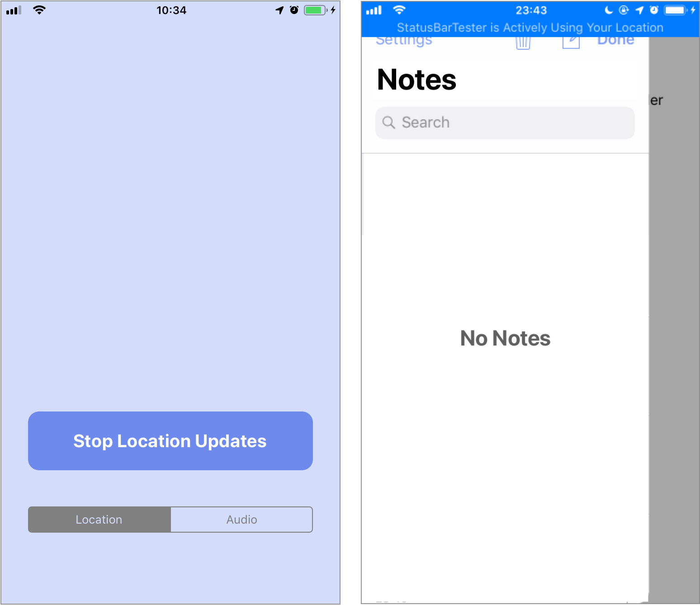

# Status Bar Tester

A simple app to quickly toggle the double-height status bar (on applicable devices). Makes it easy and quick to test how your app handles status bar changes on a real device.

> Like ⌘K in the Simulator but for a real device.

Swift 5, Xcode 10.3